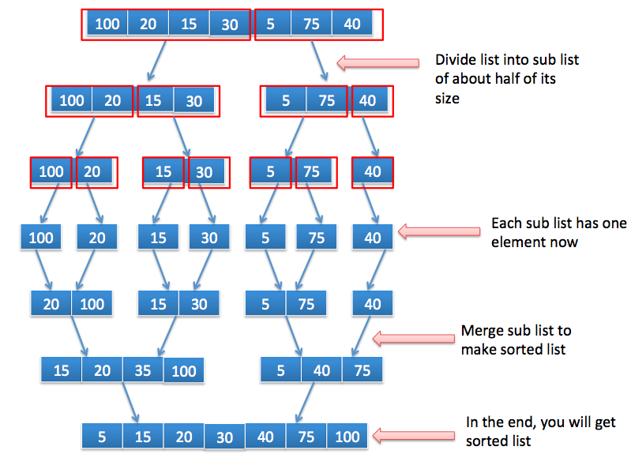

# java中的排序算法

## 1. 合并排序

合并排序是分而治之的排序算法。它是一种高效，基于比较的排序算法。

它的工作原理如下：

- 将列表划分为每次迭代中大约一半大小的子列表，直到每个子列表只有一个元素。
- 重复合并每个子列表以创建排序列表。它将一直运行，直到我们只有一个排序列表。这将是排序列表。



示例请参考**MergeSortMain.java**
```java
public class MergeSortMain {

    static int arr[] = {100, 20, 15, 30, 5, 75, 40};

    public static void main(String args[]) {
        System.out.println("数据排序之前 ： ");
        // 排序前打印数组
        printArray(arr, 0, arr.length - 1);
        System.out.println("-----------------------------");

        // 用递归实现排序
        mergeSort(0, arr.length - 1);

        System.out.println("-----------------------------");

        // 排序后打印数组
        System.out.println("排序后打印数组:");
        printArray(arr, 0, arr.length - 1);


    }

    /**
     * 用于合并排序的递归算法
     *
     * @param start
     * @param end
     */
    public static void mergeSort(int start, int end) {
        int mid = (start + end) / 2;
        if (start < end) {
            // 排序左半部分
            mergeSort(start, mid);
            // 排序右半部分
            mergeSort(mid + 1, end);
            // 合并左右两半
            merge(start, mid, end);
        }

    }


    private static void merge(int start, int mid, int end) {
        // 初始化临时数组和索引
        int[] tempArray = new int[arr.length];
        int tempArrayIndex = start;

        System.out.print("合并前:  ");
        printArray(arr, start, end);

        int startIndex = start;
        int midIndex = mid + 1;

        // 它将迭代直到较小的列表到达结尾
        while (startIndex <= mid && midIndex <= end) {
            if (arr[startIndex] < arr[midIndex]) {
                tempArray[tempArrayIndex++] = arr[startIndex++];
            } else {
                tempArray[tempArrayIndex++] = arr[midIndex++];
            }
        }

        // 复制剩余的元素
        while (startIndex <= mid) {
            tempArray[tempArrayIndex++] = arr[startIndex++];
        }
        while (midIndex <= end) {
            tempArray[tempArrayIndex++] = arr[midIndex++];
        }

        // 排序后将tempArray复制到实际数组
        for (int i = start; i <= end; i++) {
            arr[i] = tempArray[i];
        }

        System.out.print("合并后:   ");
        printArray(tempArray, start, end);
        System.out.println();
    }

    /**
     * 打印数组
     *
     * @param arr   传入的数组
     * @param start 遍历开始的位置
     * @param end   遍历结束的位置
     */
    public static void printArray(int arr[], int start, int end) {
        for (int i = start; i <= end; i++) {
            System.out.print(arr[i] + " ");
        }
        System.out.println();
    }
}

```

## 2. 冒泡排序

#### 冒泡排序算法：

冒泡排序通过迭代第一个元素到最后一个元素，比较两个相邻元素并交换它们（如果它们的顺序不正确）来工作。每次迭代都会将下一个较大的值放在正确的位置

冒泡排序可以按升序或降序进行。

**被称为下沉排序的原因：**

较大的值可能被认为较重，因此可以看到逐渐下沉到列表的底部

**被称为冒泡排序的原因：**

较小的值可能被认为较轻，因此可以看到逐渐冒泡到列表的顶部

示例

```java
public class BubbleSortMain {
 /*
  * @author: Arpit Mandliya
 */
 
 public static void main(String args[])
 {
  int  arr[]={100,20,15,30,5,75,40};
  bubbleSort(arr);
 
 }
 
 public static int[] bubbleSort(int arr[])
 {
  for (int i = 0; i < arr.length; i++) {
   for (int j = 0; j < arr.length-1-i; j++) { 
     if(arr[j]>arr[j+1])
     {
       int temp=arr[j];
       arr[j]=arr[j+1];
       arr[j+1]=temp;
     }
   }
   System.out.print("Iteration "+(i+1)+": ");
   printArray(arr);
  }
  return arr;
 }
 
 public static void printArray(int arr[])
 {
  for (int i = 0; i <arr.length; i++) {
   System.out.print(arr[i]+" ");
  }
  System.out.println();
 }
}
 
```

## 3. 插入排序

## **java中的插入排序：**

插入排序的工作原理是将索引处的值与其所有先前元素进行比较。我们将值放在索引处，其中元素没有较小的值。所以当你到达最后一个元素时，我们得到一个有序数组。
**让我们看看它是如何工作的：**
让我们说你的阵列为**{100,20,15,30,5,75}**

1. 将20与100进行比较，因为20小于100，我们的数组将变为{100,100,15,30,5,75}。我们已达到第0个指数，我们将放置20到0的指数{20,100,15,30,5,75}
2. 将15与100进行比较，因为它更少，我们的数组将变为{20,100,100,30,5,75}。现在将20与15进行比较，它再次减少，我们的数组将变为{20,20,100,30,5,75}。当我们再次到达阵列的开始时。将第15位放在第0位。我们的阵列将成为{15,20,100,30,5,75}
3. 将30与100进行比较，因为它更少，我们的数组将变为{15,20,100,100,5,75}。现在再次比较30和20，它更多，所以我们将停在这里，因为我们达到指数30大于15和20.所以我们将把30放在这个指数上。我们的阵列将成为{15,20,30,100,5,75}
4. 将5与100进行比较，因为它更少，我们的数组将变为{15,20,30,100,100,75}。现在再次比较30和5，它更少，我们的数组将变为{15,20,30,30,100,75}。同样20和5，它更少，我们的数组将变为{15,20,20,30,100,75}。比较15与5，它更少，我们的数组将变为{15,15,20,30,100,75}。当我们再次到达阵列的开始时。将第5位放在第0位。我们的数组将成为{5,15,20,30,100,75}
5. 比较75与100，它更少，所以我们的数组将变为{5,15,20,30,100,100}。现在再次比较30和75，它更多，所以我们将停在这里，因为我们达到指数75大于5,15,20和30.所以我们将把75指数放在这个指数上。我们的阵列将成为{5,15,20,30,75,100}
6. 最后我们得到了排序数组。

示例

```java
public class InsertionSortMain {
 
	public static void main(String args[])
	{
		int  arr[]={100,20,15,30,5,75};
		insertionSort(arr);
 
	}
 
	public static int[] insertionSort(int arr[])
	{
		for (int i = 1; i < arr.length; i++) 
		{ 
			int valueToSort = arr[i];
			int j; 
			// 如果我们得到的值小于valueToSort那么我们就停在那个索引处。
			for ( j = i; j > 0 && arr[j - 1] > valueToSort; j--) {
				arr[j] = arr[j - 1];
			}
 
			// 我们将valueToSort放在该索引处
			arr[j] = valueToSort;
			System.out.print("Iteration "+(i)+": ");
			printArray(arr);
		}
 
		return arr;
	}
	public static void printArray(int arr[])
	{
		for (int i = 0; i <arr.length; i++) {
			System.out.print(arr[i]+" ");
		}
		System.out.println();
	}
}
 
```

